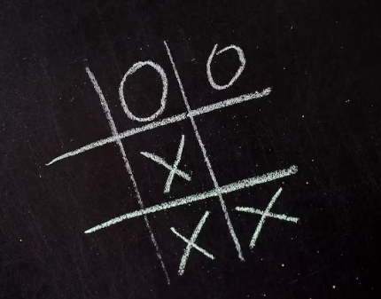
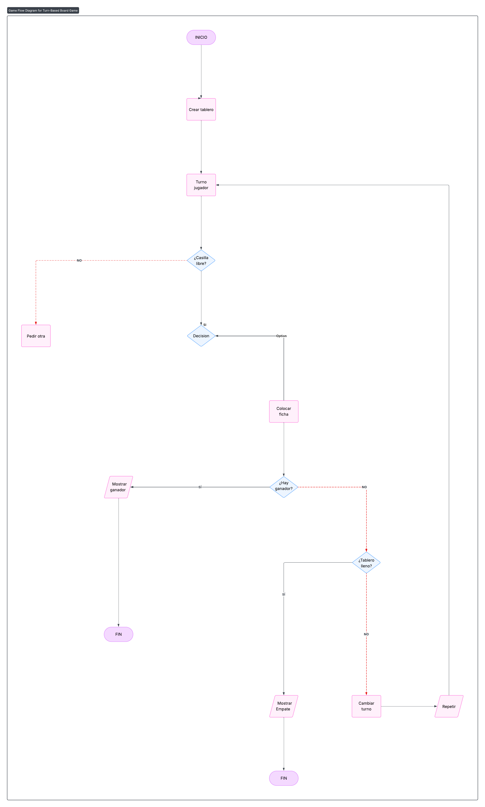

# Juego Tic Tac Toe

El juego de **Tic Tac Toe o Tres en línea** es un clásico juego de estrategia entre dos jugadores que se turnan para colocar sus símbolos en una cuadrícula de 3x3:

- El jugador 1 usa el símbolo ❌ (equis),

- El jugador 2 usa el símbolo ⭕ (círculo),

El objetivo es formar una línea recta con tres símbolos iguales: horizontal, vertical o diagonal.

Este juego combina lógica, anticipación y rapidez mental, siendo utilizado en todo el mundo como una forma divertida y educativa de competir entre dos personas.

## Historia

El Tic Tac Toe, también conocido como Tres en Línea o Gato, es uno de los juegos de mesa más antiguos y sencillos del mundo. 

Sus orígenes se remontan al Imperio Romano, donde existía un juego llamado Terni Lapilli, que se jugaba con piedras sobre un tablero marcado en superficies de piedra.

Con el paso del tiempo, este juego fue evolucionando y adoptando reglas más simples. Durante el siglo XIX se popularizó en Inglaterra con el nombre Noughts and Crosses (Ceros y Cruces). 

Finalmente, en Estados Unidos se le dio el nombre de Tic Tac Toe, por la forma en que los jugadores alternan turnos rápidamente.

Hoy en día, el Tic Tac Toe es considerado un clásico universal. Es utilizado no solo como entretenimiento, sino también en clases de matemáticas, programación y lógica, ya que ayuda a desarrollar el pensamiento estratégico y la resolución de problemas

## Curiosodades

- En algunos países se le llama Tres en raya, La vieja, Ta-te-ti o Juego del gato.

- Es uno de los pocos juegos donde, si ambos jugadores juegan perfectamente, siempre termina en empate.

- Existen variantes con tableros más grandes (4x4, 5x5) o reglas adicionales para aumentar la dificultad.

## Regalas y Mecanicas del Tic Tac Toe

El tablero consiste en una cuadrícula de 3x3 casillas.

Participan dos jugadores:
- Uno utiliza el símbolo ✖️
- El otro utiliza el símbolo ⭕

Los jugadores se turnan para colocar su símbolo en una casilla vacía.

El objetivo es conseguir tres símbolos iguales seguidos, ya sea:

- Horizontalmente (en una fila).
- Verticalmente (en una columna).
- Diagonalmente.

Si un jugador logra alinear tres de sus símbolos, gana la partida. ✅

Si todas las casillas se llenan y ningún jugador consigue tres en línea, el resultado es empate.⛔

## Algoritmo

 1. Iniciar el juego.

 2. Mostrar el tablero vacío (3x3).

 3. Definir la elección del jugador inicial y colocar su símbolo ✖️ o ⭕.

 4. Mientras el juego no haya terminado:
    
    - El jugador eligue una casilla.

    - Si la casilla esta vacía, colocar el símbolo.

    
5. Verificar si el jugador ha ganado.

6. Si no ha ganado, generar la jugada de la computadora y colocar su símbolo ⭕.

7. Verificar si la computadora ha ganado.

8. Si nadie ha ganado y hay casillas disponibles, repetir desde el paso 4.

9. Si se llena el tablero sin ganador, mostrar **"¡Empate!".** 🔁

10. Si hay un ganador, mostrar:

    **"¡Ganaste!" si el jugador logra tres en línea.** ✅

    **"¡Perdiste!" si la computadora gana.** ❌

11. Fin del juego.

## Diagrama de Flujo

## Prompt IA
Crea una  versión web del juego  Tic Tac Toe completo en HTML para jugar contra la computadora. El jugador debe de elegir que fichas quiere utilizar si (X) o (O), el tablero debe ser de 3x3 interactiva donde al hacer click en una celda vacia se coloca la ficha y la computadora debe responder automaticamente con un movimiento valido. El juego detecta ganador, perdedor o empate y lo muestra claramente, te aparace tambien la opcion de si quieres volver a jugar.

Quiero un estilo visual con tema futurista y aesthetic con colores oscuros, las fichas que resalten con colores neon. Bordes suaves con efectos para dar profundidad y con tipografia moderna.

El juego debe funcionar completamente en el navegador sin dependencias externas.

## Link Conversación con Chat Gpt

https://chatgpt.com/share/68da4400-de50-8006-9c5d-e64d782435c4

