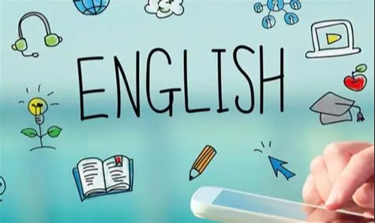
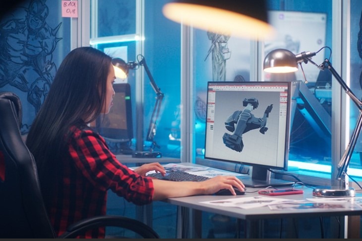
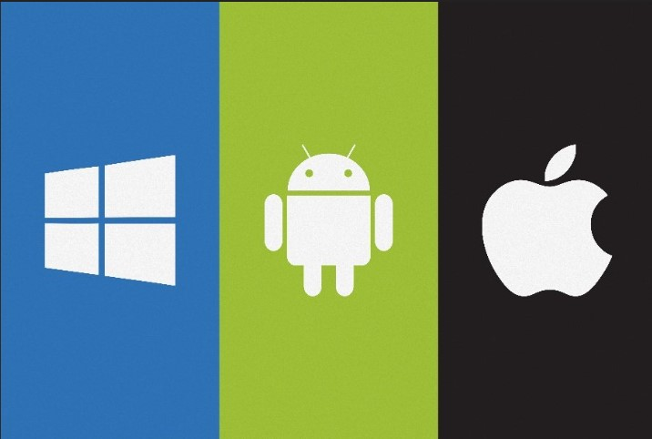
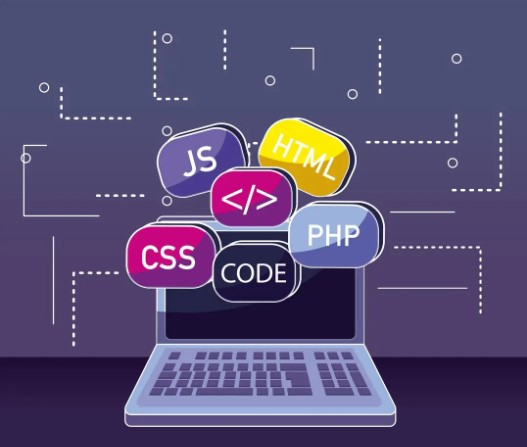
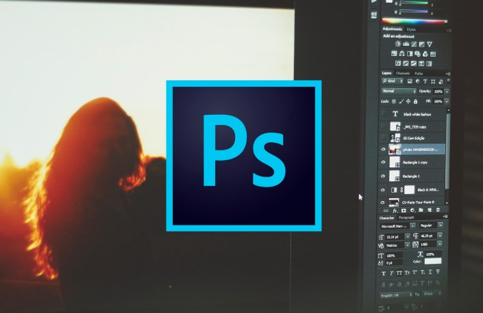

# Asignaturas 3DEVs
## Ingles
### Emilia
### Estamos aprendiendo el verbo to be.

## Diseño de Videojuegos
### Ana Guadalupe Olivar
###### Estamos aprendiendo a desarrollar la narrativa en los videojuegos.

=======
## Sistemas Operativos
### Alcides Albora
###### Como instalar Ubuntu y los sitemas que tiene una computadora.

## Lenguajes Interpretados
### Jonathan Miranda
###### Estamos aprendiendo a usar git

## Principios de Diseño
### Roberto Melo
###### Estamos aprendiendo a usar photoshop.

## Proyecto App
### Eduardo Guerrero
###### Estamos aprendiendo desarollar un juego web.
